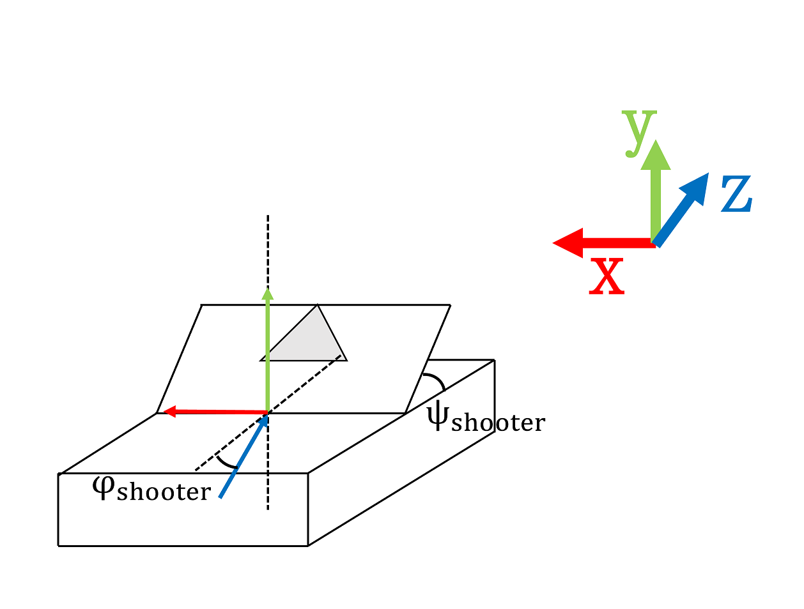

# robot3_ros
ROS

6自由度マニピュレータで中空のボールをキャッチするシミュレータ

# ライブラリ
time

numpy

# 配置


# 動かしている様子
現在準備中

# 概要
コマンドを用いて発射台の位置、姿勢、初速を指定し、ボールを発射します。

マニピュレータは発射されたボールの最高到達点(y座標が最も大きくなる位置)に向かって動き、最高到達点に達する時刻にハンドを閉じます。

ハンドを閉じた瞬間ターミナルにハンドの座標系から見たボールの相対座標とキャッチ出来たか否かが表示されます。また、キャッチ出来たときはrviz上のボールが停止します。

**物理シミュレータではありません**。物理的パラメータは設定していません。

マニピュレータに加わる重力や遠心力は計算せず、ボールは放物線こそ描きますが、計算上では質点ですらない点です


# 使い方
### 1.コマンドで発射台の位置、姿勢を指定
下記コマンドで発射台の位置、姿勢を指定します。

コマンド末尾のリスト内、**x_shooter**は発射台のx座標(単位はm、-10以上10以下)、**z_shooter**はz座標(単位はm、-10以上0以下)、**phi_shooter**はy軸まわりの角度(弧度法、-4以上4以下)、**psi_shooter**はxz平面に対する角度(弧度法、0以上3.15以下)を入れてください。
```
rostopic pub -1 /shooter_state_input std_msgs/Float32MultiArray "layout:
  dim:
  - label: ''
    size: 4
    stride: 0
  data_offset: 0
data: [x_shooter, z_shooter, phi_shooter, psi_shooter]"
```
### 2.コマンドでボールの初速を指定、発射
下記コマンドでボールの初速を指定し、発射します。
コマンド末尾の **v_0** に発射した瞬間の速さ(単位はm/s)を入れてください。その速さでボールが発射されます。
```
rostopic pub -1 /shoot_value std_msgs/Float32 "data: v_0"
```


# 諸々のパラメータ
### マニピュレータ


質量は設定されていません。
##### 基準姿勢と各リンクの長さ

### 発射台

大きさ、質量などは設定されていません。
##### 基準姿勢

### ボール
大きさ、質量などは設定されていません。

初速はユーザが指定し、中空では重力以外の力を受けず、キャッチはハンドから見た相対位置、相対速度が規定の範囲内かで判定します。そのため物理的パラメータは設定しませんでした。
### 各パラメータの上限、下限
|オブジェクト|パラメータ|単位|下限|上限|
|:---|:---|:---:|:---:|:---:|
|マニピュレータ|&theta;\_i(i=1,...,6)|rad|-4|4|
|発射台|x座標|m|-10|10|
||y座標|m|0|0|
||z座標|m|-10|0|
||&phi;\_shooter|rad|-2|2|
||&psi;\_shooter|rad|0|1.55|


# ボールをキャッチ出来たかの判定について
ハンドを閉じた瞬間にボールがハンドの座標系から見て
1. 幅0.04m、高さ0.1m、奥行き0.1mの直方体の内部
2. 相対速度とハンド座標系のz軸方向単位ベクトルとの内積の絶対値>=相対速度の絶対値×0.75
3. 相対速度とハンド座標系のy軸方向単位ベクトルとの内積>=相対速度の絶対値×-0.5
ならばキャッチ出来たと判定します。


# ROSノード、トピック、サービス
## ノード、トピックの関係

## 各トピックについて
### /shooter_state_input
std_msgs/Float32MultiArray型

x座標(m)、z座標(m)、y軸まわりの角度(rad)、xz平面となす角度(rad)の4個の要素からなります。

ユーザがコマンドを用いて入力します。
### /shoot_value
std_msgs/Float32型

ボールの初速(m/s)です。

ユーザがコマンドを用いて入力します。
### /shooter_state
std_msgs/Float32MultiArray型

x座標(m)、z座標(m)、y軸まわりの角度(rad)、xz平面となす角度(rad)の4個の要素からなります。
### /ball_initial_state
std_msgs/Float32MultiArray型

発射された瞬間の時刻(s)、座標(m)、速度(m/s)の7個の要素からなります。
### /target_arm_state
std_msgs/Float32MultiArray型

ハンドの目標となる位置(m)、姿勢を表す行列、速度(m/s)、姿勢の微分の24個の要素からなります。
### /hand_close_reserve
std_msgs/Float32型

ハンドを閉じるべき時刻(s)です。
### /arm_ang_angv
std_msgs/Float32MultiArray型

マニピュレータの各軸の角度(rad)、角速度(rad/s)の12個の要素からなります。
### /hand_close
robot3_18c1054/msg/HandClose型

HandClose型の定義は下記の通りです。
#### HandClose.msg
```
bool close
float32 time_stamp
```

ハンドを閉じるか開けるか(閉じるならばTrue、開けるならばFalse)、publishした時刻(s)の2個の要素からなります。
## 各ノードについて
### visualizer
0.1(デフォルト)秒に1回の頻度で/joint_statesをpublishします。

/hand_closeをsubscribeすると、GetHandStateサービスを用いてハンドの位置、速度、姿勢を取得し、ボールの現在位置、速度と比べることでキャッチしたかを判定します。
### arm_controller
0.1(デフォルト)秒に1回の頻度で各軸の現在の角度、角速度を更新、それを/arm_ang_angvでpublishします。

この際、角度、角速度はPD制御で制御し、現在の角度と目標の角度の差が大きいならばDゲインは0、現在の角速度が速すぎるならばP、Dゲインともに0、どちらでもないならば適当な安定となるようなゲインを用います。

0.013(デフォルト)秒に1回の頻度でハンドを閉じる(開く)べきかを判定します。もし閉じる(開く)必要があるならばTrue(False)を/hand_closeでpublishします。

/hand_close_reserveをsubscribeしたときはトピックからハンドを閉じるべき時刻を取得し上の判定に用います。

GetHandStateサービスを要求されたときはその時点のハンドの位置、姿勢(を表す行列)、速度、姿勢の微分を返します。
### shooter_controller_simple
/shooter_state_inputをsubscribeすると、トピック内データに従い発射台の位置、姿勢を更新、/shooter_stateをpublishします。また更新の際、動ける範囲("使い方"または"諸々のパラメータ"参照)を超えた値をsubscribeしたならば範囲を超えず、最もsubscribeした値に近い値を使用します。

/shoot_valueをsubscribeすると、トピックから初速を取得し、その時点での発射台の姿勢をもとにボールの初期状態を計算、発射された時間とボールの初期状態を/ball_initial_stateとしてpublishします。
### ball_initial_to_arm_target
/ball_initial_stateをsubscribeすると、ボールが最高到達点に達する時刻、最高到達点の座標、その時点でのボールが進む向きを計算し、時刻は/hand_close_reserveとして、座標と向きは/target_arm_stateとしてpublishします。

このとき、/target_arm_state内には速度の要素もありますが、これはすべて0にします。(すなわち、マニピュレータには最高到達点で静止するようにします。)
## 各サービスについて
### GetHandState
ros3_18c1054/srv/GetHandState型

GetHandState型の定義は以下の通りです。
#### GetHandState.srv
```
---
float32[] hand_state
```
引数はありません。

戻り値はハンドの位置、姿勢を表す行列、速度、姿勢の微分の24個の要素からなります。

サーバはarm_controllerです。

マニピュレータの各軸の角度、角速度から順運動学でハンドの位置等を計算します。
### GetInitTime
ros3_18c1054/srv/GetInitTime型

GetInitTime型の定義は以下の通りです。
#### GetInitTime.srv
```
---
int32 year
int32 month
int32 day
int32 hour
int32 minute
int32 second
float32 lower
```
引数はありません。

戻り値はサーバとなるノードの起動時間に対し、yearは整数部分を12×30×24×60×60で割った商、monthは30×24×60×60で、dayは24×60×60で、hourは60×60で、minuteは60で割った商、secondは60で割った余り、lowerは小数部分です。

サーバはarm_controllerです。

サーバとなるノードの起動時刻をいくつかの値に分割して渡します。

時刻を扱うトピックがいくつかありますが、ROSのpublish、subscribeは上数桁以降に誤差があり、time.time()で取得した値をそのままpublishすると数十秒程度の誤差が出ます。

よって時刻を扱うノードは起動時にあらかじめGetInitTimeサービスを用いarm_controllerノードの起動時刻を取得します。そして時刻を扱うトピックではその時刻からの相対時刻でやりとりします。

そうすることで扱う値が小さくなり誤差の影響が小さくなります。
## デバッグに用いたトピック
#### /ang_debug
Float32MultiArray型

マニピュレータの各軸の角度(rad)の6つの要素からなります。

arm_controllerはこのトピックをsubscribeすると、トピックで指定された角度を目標にマニピュレータを動かし始めます。

ユーザがコマンドで入力します。


# 参考にしたサイトなど
- python関連
  - [note.nkmk.me](https://note.nkmk.me/python/)
    - pythonの文法はじめ色々なことが載っているサイトです。
  - [Qiita, pythonの if \_\_name\_\_ == '\_\_main\_\_':は何のためにあるのか。](https://qiita.com/suiru_nakamura/items/dca13669abdf29404f38)
  - [あなたのデータサイエンス力を飛躍的に向上させるNumPy徹底入門](https://deepage.net/features/numpy/)
  - [Python(Numpy)の@（アット）演算子を使って見る話](https://ensekitt.hatenablog.com/entry/2018/07/23/200000)
- ROS関連
  - [ja/ROS/Tutorials](http://wiki.ros.org/ja/ROS/Tutorials)
    - ROS公式のチュートリアルです。
  - [Qiita, ROS講座00 目次](https://qiita.com/srs/items/5f44440afea0eb616b4a)
    - だいたいの部分は上の公式チュートリアルとこのサイトを参考に書いています。
  - [Qiita,【Python】ROSのプログラムをPythonのclassを使ったらとても便利だった](https://qiita.com/koichi_baseball/items/d15d52856188120647f4)
    - classを使った記法の参考にしました。
- その他
  - 「ロボットマニピュレータ」の授業資料
    - 理論部分の参考にしました。

思い出せるかぎり書き出しましたが、コードを書いてからREADMEを書くまで時間が空いてしまったので書き漏らしがあると思います。申し訳ありません。


# 諸注意
arm_controller.pyにはハンドの速度、姿勢の微分の逆運動学に関する部分(ヤコビアンの計算)がありますが、デバッグをしていないので使用しないようにしてください。

具体的には、コマンドを用いて/ang_debugをpublishする際、要素が12個以上のリストをpublishしないでください。


# ライセンス
MIT License

LICENSEをお読みください。
